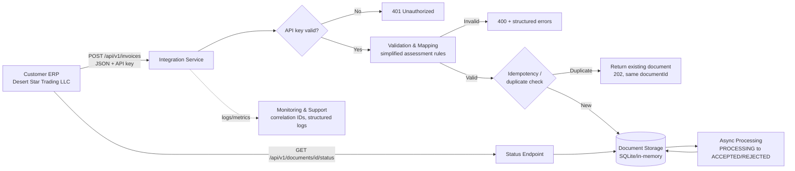

# Discovery and Integration Design

## 1. Ten questions for the customer's ERP, IT, and Finance teams

1. What ERP system and version generates these invoices, and does it expose a real API, or would we need file export / manual upload instead?
2. Who is the technical owner on the customer side who can authorize and support a test connection during UAT?
3. Does the ERP support outbound webhooks, or does it require us to poll for new invoices?
4. What authentication does the ERP's own API use (API key, OAuth2, mTLS), if we ever need to call back into it (e.g. to write back a status)?
5. What is the expected invoice volume per day/month, and are there predictable peak periods (month-end, quarter-end)?
6. Does the ERP ever emit multiple currencies, and if so, where does the exchange rate and rate date come from?
7. How does the ERP currently generate/format the seller TRN, and is it validated at source, or should we assume it can be malformed?
8. What is the customer's expectation for credit notes — always linked 1:1 to an original invoice, or can they reference multiple invoices/partial amounts?
9. Who is the business owner responsible for approving rejected invoices for correction and resubmission, and what is the expected turnaround time?
10. What are the customer's requirements for data retention and access to historical documents/logs (for audit purposes)?

## 2. Key assumptions, dependencies, and risks

**Assumptions**
- The sample payload's field names and nesting are representative of the real ERP export; if the real integration turns out to be file-based (CSV/flat file) rather than JSON API, the validation and mapping logic is reusable but the transport layer is not.
- `taxRate` supplied by the source is informational only — the prototype recalculates the rate from `taxCategory` per the assessment rules rather than trusting the source value, since the two could disagree.
- A single Idempotency-Key strategy (client-supplied header, falling back to a derived key from invoiceNo + seller TRN + documentType) is acceptable for this exercise. A production system would likely mandate the header.
- AED-only is acceptable for the required implementation; multi-currency is explicitly out of scope for this prototype (see section 4).

**Dependencies**
- Real seller TRNs, tax categories, and the 5% standard rate depend on active UAE FTA / PINT AE rules at the time of go-live — these should be reconfirmed with a tax SME before production, not hardcoded indefinitely.
- Correct behavior depends on the ERP sending consistent decimal precision; the prototype standardizes on 2-decimal rounding, but if the ERP sends e.g. 3-decimal unit prices, rounding-order questions need to be agreed with Finance.

**Risks**
- Silent data-quality drift: if the ERP changes field names or nesting in a future version without notice, mapping will fail loudly (which is safer than failing silently) — but customer IT needs a change-notification process.
- Duplicate detection based on (invoiceNo + sellerTrn + documentType) as a fallback could under- or over-match if the customer reuses invoice numbers across fiscal years or entities — this needs to be confirmed with Finance (see open question below).
- Without a persistent database in this prototype, "duplicate prevention" only holds for the lifetime of the running process — flagged clearly as a known limitation, not a production gap that's been overlooked.

**Open questions to raise with the customer (not answered by the assignment)**
- Should invoice numbers be considered unique per seller TRN, or globally unique across all sellers processed by this integration?
- Is there a maximum line-item count per invoice we should design for?

## 3. System-flow diagram

## 4. How API, file-based, and manual-upload implementations would differ operationally

| Aspect | API (this prototype) | File-based (SFTP/CSV drop) | Manual upload (portal) |
|---|---|---|---|
| Trigger | ERP calls the endpoint synchronously per invoice | Scheduled batch job picks up files on a schedule | Customer staff logs in and uploads a file/enters data |
| Latency | Near real-time (seconds) | Depends on batch schedule (often hourly/daily) | Depends entirely on staff availability |
| Error feedback | Immediate structured response (400/401/409/202) | Delayed — errors surface in a report/log the customer must check later | Can be surfaced immediately in the UI if the portal validates on upload |
| Duplicate control | Idempotency key / natural key at request time | Must dedupe within and across file batches (harder — a resent file can contain overlapping rows) | Portal must dedupe against already-processed documents |
| Volume handling | One request per invoice; scales with concurrent connections | Naturally batches; better for very high volumes | Practically limited to a handful of documents per session |
| Currency for AED-only extension | Add `currency` to the validation allow-list and add an FX-rate field/lookup in the mapper | Same validation logic reused; file schema needs an FX-rate column | Same validation logic reused; UI needs an FX-rate input |
| Operational ownership | Customer IT/ERP team owns the calling side | Customer IT owns file generation/delivery; we own polling/ingestion | Customer's end users own upload; we own the portal itself |

## 5. Extending beyond AED (currency)

The prototype hard-validates `currency == "AED"` per the assignment. To extend:
1. Add a configurable allow-list of supported currencies instead of a single constant.
2. Require an `exchangeRate` (and rate date) field on the source payload when `currency != "AED"`, since UAE e-invoicing normalization ultimately needs AED-equivalent amounts.
3. Recompute/validate `netAmount`/`taxAmount`/`grossAmount` in both the original currency and the AED-equivalent, and store both on the normalized document.
4. Confirm with the customer's Finance team where the exchange rate should come from (ERP-supplied vs. a central rate service) — this is exactly the kind of thing that belongs in the discovery questions above, not assumed.
