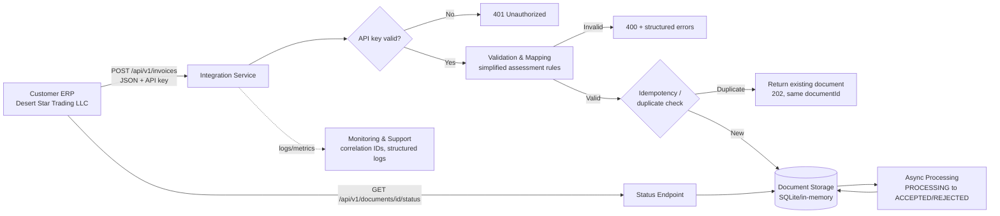

# System Flow

See `discovery-and-design.md` section 3 for narrative context. Diagram below (Mermaid).

**Legend / component notes**
- **Integration Service** — the Java prototype in `src/`, exposing the two REST endpoints.
- **Validation & Mapping** — `InvoiceValidator` (assessment rules) and `InvoiceMapper` (source-to-normalized transform).
- **Document Storage** — `DocumentStore`, currently in-memory; see README "Known limitations" for the production swap-in.
- **Async Processing** — a scheduled task simulating a downstream acceptance/rejection decision (real system would call the actual e-invoicing platform here — which this prototype explicitly does not do, per the assignment's "do not call any... environment" rule).
- **Monitoring & Support** — structured JSON logs keyed by correlation ID; see `logging/SafeLogger.java`.
